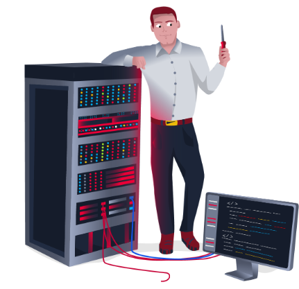

### الوظائف المتاحة في مجال الأمن السيبراني | Careers in Cyber

تعرف على الوظائف المختلفة في الأمن السيبراني.

#### المهمة 1: المقدمة | Introduction

تزداد مهن الأمن السيبراني طلبًا وتقدم [رواتب عالية](https://tryhackme.com/r/resources/blog/cyber-security-salary-career-options). هناك العديد من الوظائف المختلفة في صناعة الأمن، من اختبار الاختراق الهجومي (اختراق الأنظمة وتقديم تقارير عن الثغرات الأمنية) إلى الأمن الدفاعي (الدفاع ضد الهجمات السيبرانية والتحقيق فيها).

لماذا تختار مهنة في الأمن السيبراني:

- **رواتب عالية** - الوظائف في الأمن لها رواتب بداية مرتفعة.
- **مثير** - يمكن أن تشمل الأعمال قرصنة الأنظمة بشكل قانوني أو الدفاع ضد الهجمات السيبرانية.
- **مطلوب** - هناك أكثر من 3.5 مليون وظيفة في مجال الأمن السيبراني لم يتم شغلها.

تساعد هذه الغرفة في دخول عالم الأمن السيبراني من خلال تقديم معلومات حول أدوار الأمن السيبراني المختلفة؛ كما توفر روابط لطرق تعلم مختلفة يمكنك استخدامها لبدء بناء مهاراتك في الأمن السيبراني.

**أجب عن الأسئلة أدناه:**  
لنبدأ استكشاف الأدوار المختلفة في الأمن السيبراني!  
`لا حاجة للإجابة.`

---
#### المهمة 2: محلل أمني | Security Analyst

مسؤول عن الحفاظ على أمان بيانات المؤسسة

يعد محللو الأمن جزءًا أساسيًا من بناء تدابير الأمان عبر المؤسسات لحماية الشركة من الهجمات. يستكشف المحللون ويقيّمون الشبكات داخل الشركة لاكتشاف بيانات قابلة للتنفيذ وتوصيات للمهندسين لتطوير تدابير وقائية. تتطلب هذه الوظيفة العمل مع مختلف المعنيين لفهم متطلبات الأمان ومشهد الأمان.

**المسؤوليات**
- العمل مع مختلف المعنيين لتحليل الأمن السيبراني في جميع أنحاء الشركة.
- إعداد تقارير مستمرة حول سلامة الشبكات، وتوثيق مشكلات الأمان والتدابير المتخذة استجابةً لها.
- تطوير خطط أمان، تتضمن أبحاثًا حول أدوات الهجوم الجديدة والاتجاهات، والتدابير اللازمة عبر الفرق للحفاظ على أمان البيانات.

**مسارات التعلم**
ستوفر لك مسارات التعلم في TryHackMe المعرفة التقنية الأساسية والخبرة العملية، وهو أمر حاسم لتصبح محلل أمني ناجحًا.

- [مقدمة في الأمن السيبراني | Introduction to Cyber Security](https://tryhackme.com/r/path/outline/introtocyber)
- [الأمن السيبراني الأساسي | Pre Security](https://tryhackme.com/r/path/outline/presecurity)
- [مركز العمليات الأمنية المستوى 1 | SOC Level 1](https://tryhackme.com/r/path/outline/soclevel1)

**أجب عن الأسئلة أدناه:**  
اقرأ عن ما يفعله محلل الأمان.  
`لا حاجة للإجابة.`

---
#### المهمة 3: مهندس أمني | Security Engineer

تصميم ومراقبة وصيانة عناصر التحكم الأمنية والشبكات والأنظمة للمساعدة في منع الهجمات السيبرانية.

يعمل مهندسو الأمان على تطوير وتنفيذ حلول الأمان باستخدام بيانات التهديدات والثغرات - وغالبًا ما يتم الحصول عليها من أعضاء قوة العمل في مجال الأمن. يتعامل مهندسو الأمان مع مجموعة متنوعة من الهجمات، بما في ذلك هجمات تطبيقات الويب، وتهديدات الشبكة، والاتجاهات والتكتيكات المتطورة. الهدف النهائي هو الاحتفاظ وتبني تدابير الأمان للحد من خطر الهجوم وفقدان البيانات.

**المسؤوليات**
- اختبار وفحص تدابير الأمان عبر البرمجيات.
- مراقبة الشبكات وإعداد التقارير لتحديث الأنظمة والحد من الثغرات.
- تحديد وتنفيذ الأنظمة اللازمة لتحقيق أمان مثالي.

**مسارات التعلم**
ستوفر لك مسارات التعلم في TryHackMe المعرفة التقنية الأساسية والخبرة العملية، وهو أمر حاسم لتصبح مهندس أمان ناجحًا.

- [مركز العمليات الأمنية المستوى 1 | SOC Level 1](https://tryhackme.com/r/path/outline/soclevel1)
- [مختبر اختراق مبتدئ | JR Penetration Tester](https://tryhackme.com/r/path/outline/jrpenetrationtester)
- [اختبار الاختراق هجومي | Offensive Pentesting](https://tryhackme.com/r/path/outline/pentesting)

**أجب عن الأسئلة أدناه:**  
اقرأ عن ما يفعله مهندس الأمان.  
`لا حاجة للإجابة.`

---
#### المهمة 4: الاستجابة للحوادث | Incident Responder

يحدد ويخفف الهجمات بينما لا تزال عمليات المهاجمين مستمرة.

يستجيب مستجيبون الحوادث بشكل فعال وكفء للاختراقات الأمنية. تشمل المسؤوليات وضع خطط وسياسات وبروتوكولات للمؤسسات لتنفيذها خلال الحوادث وبعدها. وغالبًا ما تكون هذه وظيفة تحت ضغط عالٍ، حيث تتطلب تقييمات واستجابات في الوقت الحقيقي مع حدوث الهجمات. تشمل مقاييس استجابة الحوادث MTTD وMTTA وMTTR - وهي الوقت المتوسط لاكتشاف الهجمات، والاعتراف بها، والتعافي منها. الهدف هو تحقيق استجابة سريعة وفعالة، والحفاظ على الوضع المالي وتجنب الآثار السلبية للاختراق. في النهاية، يحمي مستجيب الحوادث بيانات الشركة وسمعتها ووضعها المالي من الهجمات السيبرانية.

**المسؤوليات**
- تطوير وتبني خطة استجابة للحوادث شاملة وقابلة للتنفيذ.
- الحفاظ على أفضل ممارسات الأمان ودعم تدابير استجابة الحوادث.
- إعداد التقارير بعد الحوادث والتحضير للهجمات المستقبلية، مع مراعاة الدروس المستفادة والتكيفات اللازمة من الحوادث.

**مسارات التعلم**
ستوفر لك مسارات التعلم في TryHackMe المعرفة التقنية الأساسية والخبرة العملية، وهو أمر حاسم لتصبح مستجيب حوادث ناجحًا.

- [مركز العمليات الأمنية المستوى 1 | SOC Level 1](https://tryhackme.com/r/path/outline/soclevel1)

**أجب عن الأسئلة أدناه:**  
اقرأ عن ما يفعله مستجيب الحوادث.  
`لا حاجة للإجابة.`

---
#### المهمة 5: محقق جنائي رقمي | Digital Forensics Examiner

مسؤول عن استخدام التحليلات الرقمية للتحقيق في الحوادث والجرائم.

إذا كنت تحب أن تلعب دور المحقق، فقد تكون هذه الوظيفة المثالية لك. إذا كنت تعمل كجزء من قسم إنفاذ القانون، فستركز على جمع وتحليل الأدلة للمساعدة في حل الجرائم: معاقبة المذنبين وتبرئة الأبرياء. من ناحية أخرى، إذا كانت وظيفتك تتعلق بالدفاع عن شبكة شركة، فستستخدم مهاراتك في الطب الشرعي لتحليل الحوادث، مثل انتهاكات السياسات.

**المسؤوليات**
- جمع الأدلة الرقمية مع مراعاة الإجراءات القانونية.
- تحليل الأدلة الرقمية للعثور على إجابات تتعلق بالقضية.
- توثيق نتائجك والإبلاغ عن القضية.

**أجب عن الأسئلة أدناه:**  
اقرأ عن ما يفعله فاحص الطب الشرعي الرقمي.  
`لا حاجة للإجابة.`

---
#### المهمة 6: محلل البرمجيات الخبيثة | Malware Analyst

يحلل جميع أنواع البرمجيات الخبيثة لمعرفة المزيد عن كيفية عملها وما تفعله.

يتضمن عمل محلل البرمجيات الخبيثة تحليل البرامج المريبة، واكتشاف ما تفعله، وكتابة تقارير عن نتائجهم. يُطلق على محلل البرمجيات الخبيثة أحيانًا اسم المهندس العكسي، حيث تدور مهمته الأساسية حول تحويل البرامج المترجمة من لغة الآلة إلى كود قابل للقراءة، عادةً في لغة منخفضة المستوى. تتطلب هذه الوظيفة من محلل البرمجيات الخبيثة أن يكون لديه خلفية قوية في البرمجة، خاصة في لغات البرمجة منخفضة المستوى مثل لغة التجميع ولغة C. الهدف النهائي هو معرفة جميع الأنشطة التي يقوم بها البرنامج الخبيث، واكتشاف كيفية اكتشافه، وتقديم تقرير عنه.

**المسؤوليات**
- إجراء تحليل ثابت للبرامج الضارة، مما يتضمن الهندسة العكسية.
- إجراء تحليل ديناميكي لعينات البرمجيات الخبيثة من خلال مراقبة أنشطتها في بيئة مسيطر عليها.
- توثيق وتقديم تقارير عن جميع النتائج.

**أجب عن الأسئلة أدناه:**  
اقرأ عن ما يفعله محلل البرمجيات الخبيثة.  
`لا حاجة للإجابة.`

---
#### المهمة 7: مختبر اختراق | Penetration Tester

مسؤول عن اختبار منتجات التكنولوجيا للثغرات الأمنية.

قد تُعرف اختبارات الاختراق باسم "اختبار الاختراق" أو "القرصنة الأخلاقية". تتلخص وظيفة مختبر الاختراق في اختبار أمان الأنظمة والبرمجيات داخل الشركة - ويتم ذلك من خلال محاولات للكشف عن العيوب والثغرات من خلال قرصنة منظمة. يستغل مختبرو الاختراق هذه الثغرات لتقييم المخاطر في كل حالة. يمكن للشركة بعد ذلك استخدام هذه الرؤى لتصحيح المشكلات لمنع هجوم سيبراني حقيقي.

**المسؤوليات**
- إجراء اختبارات على أنظمة الكمبيوتر والشبكات وتطبيقات الويب.
- إجراء تقييمات أمنية وتدقيق وتحليل السياسات.
- تقييم وتقديم تقارير حول الرؤى، موصيًا باتخاذ إجراءات لمنع الهجمات.

**مسارات التعلم**
ستوفر لك مسارات التعلم في TryHackMe المعرفة التقنية الأساسية والخبرة العملية، وهو أمر حاسم لتصبح مختبر اختراق ناجحًا.

- [مختبر اختراق مبتدئ | Jr Penetration Tester](https://tryhackme.com/r/path/outline/jrpenetrationtester)
- [اختبار الاختراق هجومي | Offensive Pentesting](https://tryhackme.com/r/path/outline/pentesting)

**أجب عن الأسئلة أدناه:**  
اقرأ عن ما يفعله مختبر الاختراق.  
`لا حاجة للإجابة.`

---
#### المهمة 8: فريق الهجوم الأحمر | Red Teamer

يلعب دور الخصم، مهاجمًا منظمة ويقدم تغذية راجعة من منظور الأعداء.

يمتلك أعضاء فريق الهجوم الأحمر تشابهات مع مختبري الاختراق، لكن لديهم دورًا أكثر استهدافًا. يسعى مختبرو الاختراق للكشف عن العديد من الثغرات عبر الأنظمة للحفاظ على دفاعات الأمن السيبراني، بينما يتم تكليف فريق الهجوم الأحمر لاختبار قدرات الكشف والاستجابة الخاصة بالشركة. تتطلب هذه الوظيفة تقليد إجراءات المجرمين السيبرانيين، ومحاكاة الهجمات الخبيثة، والحفاظ على الوصول، وتجنب الكشف. يمكن أن تستمر تقييمات فريق الهجوم الأحمر لمدة تصل إلى شهر، وعادةً ما تتم بواسطة فريق خارجي عن الشركة. وغالبًا ما تكون هذه الفرق الأنسب للمنظمات التي لديها برامج أمان ناضجة.

**المسؤوليات**
- تقليد دور فاعل التهديد لكشف الثغرات القابلة للاستغلال، والحفاظ على الوصول وتجنب الكشف.
- تقييم ضوابط أمان المنظمات، وذكاء التهديد، وإجراءات الاستجابة للحوادث.
- تقييم وتقديم تقارير حول الرؤى، مع بيانات قابلة للتنفيذ للشركات لتجنب الحالات الواقعية.

**مسارات التعلم**
ستوفر لك مسارات التعلم في TryHackMe المعرفة التقنية الأساسية والخبرة العملية، وهو أمر حاسم لتصبح عضوًا ناجحًا في فريق الهجوم الأحمر.

- [مختبر اختراق مبتدئ | JR Penetration Tester](https://tryhackme.com/r/path/outline/jrpenetrationtester)
- [اختبار اختراق هجومي | Offensive Pentesting](https://tryhackme.com/r/path/outline/pentesting)
- [فريق الهجوم الأحمر | Red Teamer](https://tryhackme.com/r/path/outline/redteaming)

**أجب عن الأسئلة أدناه:**  
اقرأ عن ما يفعله فريق الهجوم الأحمر.  
`لا حاجة للإجابة.`

---
#### المهمة 8: اختبار | Quiz

تقدم هذه الغرفة لمحة عامة عن المهن المختلفة في مجال الأمن السيبراني. لا تنسَ أنه يمكنك [الاستفادة من التدريب عبر الإنترنت للحصول على وظيفة أحلامك](https://tryhackme.com/r/resources/blog/online-training-for-careers) في الأمن السيبراني. لمعرفة أي دور في الأمن السيبراني يناسبك أفضل، جرب اختبارنا الممتع، الذي يمكنك الوصول إليه عن طريق النقر على زر "عرض الموقع" على اليمين.

**أجب عن الأسئلة أدناه:**
أكمل اختبار المهن وشارك الوظيفة التي اخترتها!
`لا حاجة للإجابة.`
