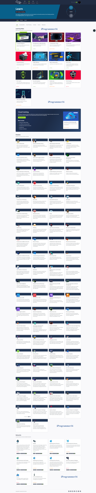

# TryHackMe Learning Journey | رحلة تعلم TryHackMe

## نبذة بسيطة عن منصة TryHackMe | A Brief Introduction to TryHackMe:

TryHackMe هي منصة تعليمية تفاعلية تهدف إلى تعزيز مهارات الأمن السيبراني من خلال تقديم محتوى تعليمي متنوع. تشمل المنصة دروسًا وتحديات عملية في مجالات مثل اختبار الاختراق، وتحليل التهديدات، والأمن الشبكي. توفر TryHackMe بيئات محاكاة حقيقية تسمح للمستخدمين بتطبيق مهاراتهم الجديدة في سيناريوهات واقعية. تستهدف المنصة جميع المستويات، بدءًا من المبتدئين وصولًا إلى المحترفين، مما يجعلها مثالية لكل من يسعى لتطوير مهاراته في هذا المجال المتنامي.

TryHackMe is an interactive learning platform aimed at enhancing cybersecurity skills by providing a diverse range of educational content. The platform includes lessons and hands-on challenges in areas such as penetration testing, threat analysis, and network security. TryHackMe offers real-life simulation environments that allow users to apply their new skills in realistic scenarios. The platform targets all levels, from beginners to professionals, making it ideal for anyone looking to develop their skills in this growing field.

## دعوة للمشاركة | Invitation to Join:

انضم إليّ في رحلة استكشاف الأمن السيبراني عبر منصة TryHackMe! هنا ستتاح لك الفرصة للتعلم من خلال مجموعة متنوعة من الدروس والتحديات العملية التي تأخذك من مستوى مبتدئ إلى مستوى محترف. سواء كنت مبتدئًا في هذا المجال أو لديك بعض الخبرة، ستجد محتوى مناسبًا يساعدك على تطوير مهاراتك بشكل فعّال. دعونا نبدأ هذه الرحلة معًا ونتقدم من مستوى مبتدئ إلى مستوى محترف في عالم الأمن السيبراني!

Join me on a journey to explore cybersecurity through TryHackMe! Here you will have the opportunity to learn through a variety of lessons and hands-on challenges that take you from a beginner to a professional level. Whether you're new to the field or have some experience, you will find suitable content that effectively helps you develop your skills. Let's start this journey together and progress from a beginner to a professional in the world of cybersecurity!

## الكورسات التي سنقوم بتعلمها | Courses We Will Learn:

| الرقم | اسم الدورة (Course Name)                                  | مستوى الصعوبة (Difficulty Level)           |
| ----- | --------------------------------------------------------- | ------------------------------------------ |
| 1     | مبتدئ شامل (Complete Beginner)                            | مبتدئ (Beginner)                           |
| 2     | الأمن قبل البدء (Pre Security)                            | مبتدئ (Beginner)                           |
| 3     | مقدمة في الأمن السيبراني (Introduction to Cyber Security) | مبتدئ (Beginner)                           |
| 4     | أساسيات الويب (Web Fundamentals)                          | مبتدئ (Beginner)                           |
| 5     | الدفاع السيبراني (Cyber Defense)                          | متوسط (Intermediate)                       |
| 6     | مركز العمليات الأمنية المستوى 1 (SOC Level 1)             | متوسط (Intermediate)                       |
| 7     | مركز العمليات الأمنية المستوى 2 (SOC Level 2)             | متوسط (Intermediate)                       |
| 8     | مختبر اختراق المبتدئين (Jr Penetration Tester)            | متوسط (Intermediate)                       |
| 9     | شهادة CompTIA Pentest+                                    | متوسط إلى متقدم (Intermediate to Advanced) |
| 10    | الاختراق الهجومي (Offensive Pentesting)                   | متقدم (Advanced)                           |
| 11    | مهندس أمان (Security Engineer)                            | متقدم (Advanced)                           |
| 12    | عمليات الأمان للمطورين (DevSecOps)                        | متقدم (Advanced)                           |
| 13    | الفريق الأحمر (Red Teaming)                               | متقدم (Advanced)                           |

---

## المسار الكامل للمبتدئين في الأمن السيبراني (Complete Beginner Path)

### مقدمة (Introduction)
تعلم المهارات الأساسية المطلوبة لبدء مسيرة مهنية في مجال الأمن السيبراني.  
(Learn the core skills required to start a career in cyber security)

#### المواضيع الأساسية (Core Topics):
- **أمان تطبيقات الويب (Web Application Security)**
- **أمان الشبكات (Network Security)**
- **أساسيات لينكس (Basic Linux)**
- **البرمجة النصية (Scripting)**

### هدف المسار (Path Objective)
يهدف مسار المبتدئين إلى تقديم مقدمة واسعة في مختلف مجالات الأمن السيبراني. سيركز هذا المسار على المناطق التالية:  
(The beginner path aims to give a broad introduction to the different areas in Computer Security. This path will be looking at the following areas:)

- **أساسيات لينكس (Basic Linux)**: تعلم كيفية التعامل مع سطر الأوامر في نظام التشغيل لينكس.  
(Get familiar with the Linux command line.)
- **أمان تطبيقات الويب (Web Application Security)**: تعلم مفاهيم أمان تطبيقات الويب من خلال OWASP Top 10.  
(Learn web application security concepts through the OWASP Top 10.)
- **أمان الشبكات (Network Security)**: استخدام أدوات أساسية مثل NMAP لتعداد البنية التحتية.  
(Using essential tools like NMAP to enumerate infrastructure.)
- **تحديات البرمجة النصية (Scripting Challenges)**: استخدام لغتي بايثون وباش لأداء مهام متعددة.  
(Using Python and Bash to carry out different tasks.)
- **تصعيد الامتيازات (Privilege Escalation)**: تعلم كيفية تصعيد الامتيازات في الأنظمة المختلفة.  
(Learn how to escalate privileges in different systems.)

#### المهارات المكتسبة (Acquired Skills)
بمجرد إكمال مسار المبتدئين، ستكتسب المعرفة الأساسية في كل مجال محدد، ويمكنك استخدام هذه المفاهيم الأساسية لبناء فهمك للمواضيع الأكثر تعقيدًا داخل كل مجال.  
(Once you complete the beginner path, you should have learnt the fundamental knowledge for each specific area, and use these core concepts to build your understanding of more complex topics within the area.)

### المتطلبات الأساسية (Prerequisites)
تحتاج إلى فهم أساسي لمبادئ الحوسبة العامة وفهم واسع لمجالات الأمن السيبراني المختلفة لإكمال هذا المسار. إذا كنت لا تمتلك هذه المتطلبات الأساسية بعد، يفضل إكمال مسار "[ما قبل الأمن | Pre Security](https://tryhackme.com/r/path/outline/presecurity)" ومسار "[مقدمة في الأمن السيبراني | Introduction to Cyber Security](https://tryhackme.com/r/path/outline/introtocyber)
".  
(You need a basic understanding of fundamental computing principles and a broad understanding of the different areas of cyber security to complete this pathway. If you do not already have these prerequisites, complete the Pre-Security Pathway and Intro To Cyber Security Pathway.)

---

## مقدمة الأمن (Pre Security)

### مقدمة (Introduction)
قبل أن تقوم باختراق أي شيء، يجب أن تفهم الأساسيات أولًا.  
(Before hacking something, you first need to understand the basics.)

#### المواضيع الأساسية (Core Topics):
- **أساسيات الأمن السيبراني (Cyber security basics)**
- **أساسيات الشبكات ونقاط الضعف (Networking basics and weaknesses)**
- **الويب والهجمات الشائعة (The web and common attacks)**
- **تعلم استخدام نظام التشغيل لينكس (Learn to use the Linux operating system)**

الأمن السيبراني غالبًا ما يُعتقد أنه عملية سحرية لا يمكن القيام بها إلا من قبل النخبة، وTryHackMe هنا لتظهر لك أن هذا ليس صحيحًا. أي شخص، بغض النظر عن مستوى خبرته، يمكنه تعلم الأمن السيبراني وهذا المسار التعليمي (Pre-Security) هو المكان المثالي للبدء.  
(Cyber security is often thought to be a magical process that can only be done by the elite, and TryHackMe is here to show you that's not the case. Anyone, with any experience level, can learn cyber security and this Pre-Security learning path is the place to start.)

#### مقدمة عامة (General Introduction)
سوف يعلمك هذا المسار التعليمي المعرفة التقنية المسبقة التي تحتاجها للبدء في الأمن السيبراني. لمهاجمة أو الدفاع عن أي تقنية، عليك أولاً أن تتعلم كيف تعمل هذه التقنية.  
(This learning path will teach you the pre-requisite technical knowledge to get started in cyber security. To attack or defend any technology, you have to first learn how this technology works.)

مسار ما قبل الأمن هو وسيلة ممتعة وسهلة للمبتدئين لتعلم الأساسيات. رحلتك في تعلم الأمن السيبراني تبدأ هنا!  
(The Pre-Security learning path is a beginner-friendly and fun way to learn the basics. Your cyber security learning journey starts here!)

---

## مقدمة في الأمن السيبراني (Introduction to Cyber Security)

### مقدمة (Introduction)
تعلم المهارات الأساسية المطلوبة لبدء مسيرة مهنية في مجال الأمن السيبراني.  
(Learn the core skills required to start a career in cyber security)

#### المواضيع الأساسية (Core Topics):
- **تعرف على الوظائف المختلفة في مجال الأمن السيبراني (Learn about different careers in cyber)**
- **اختراق تطبيقك الأول (Hack your first application)**
- **الدفاع ضد هجوم سيبراني حي (Defend against a live cyber attack)**
- **استكشاف موضوعات الأمان في المجال (Explore security topics in the industry)**

### البداية في الأمن السيبراني (Getting Started)
ابدأ في مجال الأمن السيبراني من خلال اختراق تطبيقك الأول والدفاع ضد هجوم سيبراني حي في بيئة مختبرية محاكاة. تعرف على الوظائف المختلفة في مجال الأمن السيبراني، الأدوار، والمهارات المطلوبة للحصول على وظيفتك الأولى في المجال.  
(Get started in cyber security by hacking your first application and defending against a live cyber attack in a simulated lab environment. Learn about the different cyber careers, roles, and skills required to get your first job in the industry.)

#### المهارات الأساسية المكتسبة (Acquired Core Skills):
- **تعرف على الوظائف المختلفة في مجال الأمن السيبراني (Learn about different careers in cyber)**
- **اختراق تطبيقك الأول (Hack your first application)**
- **الدفاع ضد هجوم سيبراني حي (Defend against a live cyber attack)**
- **استكشاف موضوعات الأمان في المجال (Explore security topics in the industry)**

### مقدمة عامة (General Introduction)
يُعد الأمن السيبراني موضوعًا واسعًا، وقد يكون من الصعب معرفة من أين تبدأ. يوفر لك هذا المسار مقدمة عملية في مختلف المجالات داخل الأمن السيبراني، بما في ذلك:  
(Cyber Security is a huge topic, and it can be challenging to know where to start. This path will give you a hands-on introduction to different areas within cyber, including:)

- **الوظائف في مجال الأمن السيبراني (Careers in Cyber Security)**
- **الأمن الهجومي: اختراق تطبيقك الأول (Offensive Security: hacking your first application)**
- **الأمن الدفاعي: الدفاع ضد هجوم سيبراني حي (Defensive Security: defending against a live cyber attack)**
- **استكشاف موضوعات الأمان في المجال (Exploring security topics in the industry)**

#### الفائدة المكتسبة (Gained Knowledge)
بإكمال هذا المسار التعليمي، ستحصل على المعرفة اللازمة لبدء رحلتك في مجال الأمن السيبراني.  
(Completing this learning path will give you the knowledge to kick start your cyber journey.)

---

## أساسيات الويب (Web Fundamentals)

### مقدمة (Introduction)
مسار نحو أمان تطبيقات الويب.  
(A pathway to web application security.)

#### المواضيع الأساسية (Core Topics):
- **فهم أساسيات الويب (Understand web fundamentals)**
- **شرح الثغرات الرئيسية (Major vulnerabilities explained)**
- **تعلم الأدوات المستخدمة في المجال (Learn industry-used tools)**
- **تقييمات تطبيقات الويب (Web application assessments)**

تعلم كيفية الهجوم على تطبيقات الويب من خلال تمارين تفاعلية وعالمية.  
(Learn how to attack web applications through interactive and real-world exercises.)

#### الهدف من المسار (Pathway Aim)
الهدف من هذا المسار هو تعليمك كيفية الهجوم على تطبيقات الويب. لكي تتمكن من الهجوم بنجاح واستغلال تطبيقات الويب، تحتاج إلى فهم كيفية عملها. سيقدم لك القسم الأول (أساسيات الويب) كل المعرفة المسبقة اللازمة لذلك.

يركز القسم الثاني (أدوات الأمان) على تعلم كيفية استخدام أدوات المعايير الصناعية للتفاعل مع الأهداف الخاصة بك.

يغطي القسم الثالث (الثغرات) مختلف الثغرات الموجودة في تطبيقات الويب اليوم. سوف يتناول هذا القسم الأسباب الجذرية لهذه الثغرات ويقدم لك خبرة عملية في استغلالها.

سيساعدك القسم الأخير (التطبيق هو الأهم) في تطبيق ما تعلمته في الأقسام السابقة.

#### بعد إكمال هذا المسار، يجب أن تكون قادرًا على: 
- **فهم كيفية عمل تطبيقات الويب (understand how web applications work)**
- **استخدام أدوات المعايير الصناعية عند مهاجمة تطبيقات الويب (utilise industry standard tooling when attacking web applications)**
- **شرح واستغلال الثغرات الشائعة في الويب (explain and exploit common web vulnerabilities)**
- **تطبيق هذه المعرفة على أهداف أخرى (be it within an interview or a professional web applications security assessment)**

---

## دفاع السيبراني (Cyber Defense)

### مقدمة (Introduction)
تعلم كيف تحلل وتدافع ضد تهديدات/هجمات السيبرانية في العالم الحقيقي.  
(Learn how to analyse and defend against real-world cyber threats/attacks.)

#### المواضيع الأساسية (Core Topics):
- **كشف التهديدات (Detect threats)**
- **جمع معلومات عن المهاجمين (Gather threat actor intelligence)**
- **فهم وتقليد تقنيات وأساليب الخصوم (Understand and emulate adversary TTPs)**
- **تحديد والاستجابة للحوادث (Identify and respond to incidents)**

في عالم اليوم، تعتبر الدفاعات بنفس أهمية الهجمات، إن لم تكن أكثر أهمية. الأمن الدفاعي يحتوي على العديد من المجالات المختلفة، وهذا المسار سوف يمنحك قاعدة معرفية واسعة تسمح لك بالتخصص في أي من مجالات الفريق الأزرق المذكورة.  
(In today's world, defending is just as important as attacking, if not more. Defensive Security has a lot of different areas and this path will give you a broad knowledge base that will allow you to specialise in any of the aforementioned blue team areas.)

#### مقدمة عامة (General Introduction)
يسعى مسار الدفاع السيبراني إلى تقديم مقدمة شاملة للمجالات المختلفة اللازمة لاكتشاف والرد على التهديدات. سوف يتناول هذا المسار المجالات التالية:  
(The Cyber Defense path aims to give a broad introduction to the different areas necessary to detect and respond to threats. This path will be looking at the following areas:)

- **البدء (Getting Started)**
- **إدارة التهديدات ونقاط الضعف (Threat and Vulnerability Management)**
- **عمليات الأمن والمراقبة (Security Operations and Monitoring)**
- **محاكاة التهديدات (Threat Emulation)**
- **الاستجابة للحوادث والطب الشرعي (Incident Response & Forensics)**
- **تحليل البرمجيات الخبيثة والهندسة العكسية (Malware Analysis and Reverse Engineering)**

بمجرد إكمال هذا المسار، يجب أن يكون لديك العناصر الأساسية لكشف والرد على التهديدات في بيئة مؤسسية واستخدام هذه المفاهيم الأساسية لبناء فهمك لمواضيع أكثر تعقيدًا في هذا المجال.  
(Once you complete this path, you should have the fundamental components of detecting and responding to threats in a corporate environment and using these core concepts to build your understanding of more complex topics within this field.)

> **ملاحظة:** هذا المسار لا يزال قيد التطوير وسيتم إضافة المزيد من المحتوى عند توفره.  
(Note: This pathway is still under development and more rooms will be added as they become available.)

---

## مركز العمليات الأمنية المستوى 1 (SOC Level 1)

### مقدمة (Introduction)
تعلم المهارات اللازمة للعمل كمحلل أمان مبتدئ في مركز العمليات الأمنية.  
(Learn the skills needed to work as a Junior Security Analyst in a Security Operations Centre.)

#### المواضيع الأساسية (Core Topics):
- **كشف وتحليل الشذوذ في حركة المرور (Detect and analyse traffic anomalies)**
- **مراقبة النقاط النهائية للتهديدات (Monitor endpoints for threats)**
- **استخدام أدوات SIEM للتعامل مع الحوادث (Utilise SIEM tools to handle incidents)**
- **التحقيق في الأدلة الجنائية (Investigate forensic artefacts)**

سيقدم لك هذا المسار مجموعة واسعة من الأدوات وسيناريوهات التحليل الواقعية، مما يمكنك من أن تصبح محلل أمان مبتدئ ناجح.  
(This path will introduce a wide array of tools and real-life analysis scenarios, enabling you to become a successful Junior Security Analyst.)

#### مقدمة عامة (General Introduction)
في دور محلل الأمان المبتدئ، ستكون متخصصًا في تصنيف الأحداث. ستقضي جزءًا كبيرًا من وقتك في تصنيف أو مراقبة سجلات الأحداث والتنبيهات.

تشمل مسؤوليات محلل الأمان المبتدئ أو محلل SOC من المستوى 1 ما يلي:
- **مراقبة والتحقيق في التنبيهات** (Monitor and investigate alerts) (في معظم الأحيان، يكون ذلك في بيئة عمليات SOC تعمل على مدار الساعة.)
- **تكوين وإدارة أدوات الأمان (Configure and manage security tools)**
- **تطوير وتنفيذ توقيعات IDS (Develop and implement IDS signatures)**
- **تصعيد حوادث الأمان إلى المستوى 2 و قائد الفريق إذا لزم الأمر (Escalate the security incidents to the Tier 2 and Team Lead if needed)**

---

## مركز العمليات الأمنية المستوى 2 (SOC Level 2)

### مقدمة (Introduction)
تعلم جميع المهارات اللازمة للارتقاء بمسيرتك المهنية كمحلل SOC.  
(Learn all the skills needed to take you to the next level in your SOC Analyst career.)

#### المواضيع الأساسية (Core Topics):
- **عمليات الأمان (Security operations)**
- **الاستجابة الأولية للحوادث (Introductory incident response)**
- **تحليل البرمجيات الخبيثة (Malware analysis)**
- **صيد التهديدات وتقليد التهديدات (Threat hunting and threat emulation)**

إكمال هذا المسار سيمنحك المهارات التقنية المطلوبة للنجاح والتقدم في مسيرتك المهنية كمحلل أمان.  
(Completing this path will give you the technical skills required to succeed in and advance your Security Analyst career.)

#### مقدمة عامة (General Introduction)
يهدف مسار SOC Level 2 إلى مساعدتك على النجاح في مسيرتك المهنية في مركز العمليات الأمنية. سيساعدك في الانتقال إلى منصب من المستوى 2 أو تعزيز المهارات التقنية الأساسية التي تحتاجها لتؤدي بشكل جيد في منصبك الحالي، باستخدام سيناريوهات عملية وواقعية.

من خلال السيناريوهات الواقعية، ستقوم بممارسة تحليل السجلات بعمق واكتساب خبرة عملية باستخدام منصات SIEM المختلفة.  
سيتناول المسار أيضًا موضوعات هندسة الكشف، مما يسمح لك باستكشاف المشكلات المتعلقة بالكشف والتنبيه والتسجيل وإصلاحها.  
أخيرًا، ستتعلم مهارات تقنية أساسية لأداء مهام Blue Teaming المتقدمة، مثل صيد التهديدات وتقليدها، والاستجابة للحوادث، وتحليل البرمجيات الخبيثة.

---

## مختبر اختراق مبتدئ (Jr Penetration Tester)

### مقدمة (Introduction)
تعلم المهارات اللازمة لبدء مسيرة مهنية كاختصاصي في اختراق الأنظمة.  
(Learn the necessary skills to start a career as a penetration tester)

#### المواضيع الأساسية (Core Topics):
- **أساليب وتقنيات اختراق الأنظمة (Pentesting methodologies and tactics)**
- **التعداد، الاستغلال، والتقارير (Enumeration, exploitation and reporting)**
- **تمارين اختراق عملية واقعية (Realistic hands-on hacking exercises)**
- **تعلم أدوات الأمان المستخدمة في المجال (Learn security tools used in the industry)**

### المهارات المكتسبة (Acquired Skills)
تعلم المهارات العملية المطلوبة لبدء مسيرتك المهنية كاختصاصي في اختراق الأنظمة.  
(Learn the practical skills required to start your career as a professional penetration tester.)

#### مقدمة عامة (General Introduction)
يغطي هذا المسار التعليمي المهارات التقنية الأساسية التي ستتيح لك النجاح كاختصاصي اختراق مبتدئ. بعد إكمال هذا المسار، سيكون لديك المهارات العملية اللازمة لتنفيذ تقييمات الأمان ضد تطبيقات الويب والبنية التحتية للمؤسسات.  
(This learning path covers the core technical skills that will allow you to succeed as a junior penetration tester. Upon completing this path, you will have the practical skills necessary to perform security assessments against web applications and enterprise infrastructure.)

---

## شهادة CompTIA Pentest+

### مقدمة (Introduction)
تعلم المهارات العملية واستعد للنجاح في امتحان Pentest+.  
(Learn the practical skills and prepare to ace the Pentest+ exam.)

#### المواضيع الأساسية (Core Topics):
- **تمارين عملية تتماشى مع أهداف امتحان PenTest+ (Hands-on exercises aligning to PenTest+ exam objectives)**
- **التحضير العملي للامتحان لمساعدتك في الأسئلة القائمة على الأداء (Practical exam preparation to help you with the Performance Based Questions)**

شهادة CompTIA PenTest+ مخصصة للمهنيين في مجال الأمن السيبراني الذين يتعاملون مع اختبارات الاختراق وإدارة الثغرات. استخدم هذا المسار كدعم ومحتوى تحضيري لامتحان الشهادة من CompTIA. عند إكمال هذا المسار، ستحصل على خصم 10% على الامتحان.  
(CompTIA PenTest+ is for cybersecurity professionals tasked with penetration testing and vulnerability management. Use this pathway as supporting content and pre-preparation for the CompTIA certification exam. Upon completing this pathway, get 10% off the exam.)

#### مقدمة عامة (General Introduction)
هذا المسار لامتحان PenTest+ يتيح للأفراد ممارسة معظم المهارات العملية المطلوبة لامتحان CompTIA PenTest+. في هذا المسار، ستتعلم عن:  
(This PenTest+ pathway allows individuals to practice the majority of practical skills required for the CompTIA PenTest+ exam. In this, you will learn about:)

- **أدوات اختبار الاختراق القياسية في المجال (Industry standard penetration testing tools)**
- **تحديد واستغلال خدمات الشبكة المختلفة (Identifying and exploiting different network services)**
- **استغلال تطبيقات الويب من خلال أكثر الثغرات شيوعًا اليوم (Exploiting web applications through today’s most common vulnerabilities)**
- **فهم Active Directory لنظام ويندوز ومهاجمة Kerberos (Understanding Windows active directory and attacking Kerberos)**
- **تقنيات ما بعد الاستغلال (Post exploitation techniques) (باستخدام Powerview وBloodhound وMimikatz) (with Powerview, Bloodhound and Mimikatz)**

شهادة CompTIA PenTest+ مخصصة للمهنيين في مجال الأمن السيبراني الذين يتعاملون مع اختبارات الاختراق وإدارة الثغرات.  
(CompTIA PenTest+ is for cybersecurity professionals tasked with penetration testing and vulnerability management.)

---

## اختبار الاختراق الهجومي (Offensive Pentesting)

### مقدمة (Introduction)
استعد لاختبار الاختراق في العالم الحقيقي.  
(Prepare yourself for real world penetration testing.)

#### المواضيع الأساسية (Core Topics):
- **استخدام أدوات معايير المجال (Utilise industry standard tools)**
- **تعلم سيناريوهات الهجوم الواقعية (Learn realistic attack scenarios)**
- **التدريب في الأمن الهجومي (Train in offensive security)**
- **تمارين وموارد داعمة (Supporting exercises & resources)**

اكتسب المهارات اللازمة للحصول على الشهادات المعروفة في صناعة الأمن. تعلم عن أدوات اختبار الاختراق المستخدمة في المجال واكتساب تقنيات لتصبح مختبر اختراق ناجح.  
(Acquire the skills needed to go and get certified by well known certifiers in the security industry. Learn about industry-used penetration testing tools and attain techniques to become a successful penetration tester.)

#### مقدمة عامة (General Introduction)
مهما كانت موقعك، ستكون المهارات والمتطلبات لمختبر الاختراق هي نفسها. ستحتاج إلى فهم جيد لمختلف جوانب الأمن المعلوماتي بما في ذلك تطبيقات الويب، والشبكات، وأحيانًا حتى التكنولوجيا منخفضة المستوى مثل لغة التجميع. إن الفهم الجيد لهذه التقنيات أمر أساسي لتعلم كيفية استغلالها.  
(No matter where you are, the skills and requirements for a penetration tester will be the same. You’ll be required to have a good understanding of various aspects within information security including web applications, networks and sometimes even low level technology like assembly. A good understanding of these technologies is essential to learning how to exploit them.)

الهدف من هذا المسار هو جعلك جاهزًا لاختبار الاختراق في العالم الحقيقي من خلال تعليمك كيفية استخدام أدوات معايير المجال مع منهجية للعثور على الثغرات في الآلات. بحلول الوقت الذي تكمل فيه هذا المسار، ستكون مستعدًا تمامًا للمقابلات والوظائف كمختبر اختراق. لكي تكمل هذا المسار، يجب أن يكون لديك فهم أساسي إلى متوسط للحوسبة.  
(The aim of this path is to make you ready for real world penetration testing by teaching you how to use industry standard tools along with a methodology to find vulnerabilities in machines. By the time you complete this path, you will be well prepared for interviews and jobs as a penetration tester. To complete this path you should have a basic to medium understanding of computing.)

يمكنك استخدام هذا المسار لمساعدتك في اكتساب المهارات اللازمة للحصول على الشهادات المعروفة في مجال الأمن.  
(You can use this pathway to help you acquire the skills needed to go and get certified by well known certifiers in the security industry.)

---

## مهندس الأمان (Security Engineer)

### مقدمة (Introduction)
تعلم المهارات المطلوبة لبدء مسيرتك المهنية في هندسة الأمان.  
(Learn the skills required to jumpstart your career in security engineering.)

#### المواضيع الأساسية (Core Topics):
- **هندسة أمان الشبكات (Network security engineering)**
- **هندسة أمان الأنظمة (System security engineering)**
- **هندسة أمان البرمجيات (Software security engineering)**
- **إدارة المخاطر والاستجابة للحوادث (Risk management & responding to incidents)**

استكشف مجالات مختلفة في هندسة الأمان! استخدم هذا المسار لفهم أسس بناء الأنظمة والشبكات والبرمجيات الآمنة.  
(Explore different areas of Security Engineering! Use this path to understand the foundations of building secure systems, networks, and software.)

#### مقدمة عامة (General Introduction)
يعد مهندسو الأمان حاسمين في أمان كل منظمة. يعني كونك مهندس أمان تصميم أنظمة وشبكات وبرمجيات آمنة، وفهم التهديدات والمخاطر التي يمكن أن تؤثر على المنظمة، والقدرة على المساعدة في الاستجابة للحوادث. يهدف هذا المسار إلى تقديم مقدمة عن هندسة الأمان من وجهات نظر مختلفة. بغض النظر عن التخصص الذي تختاره كمهنة في الأمن السيبراني، فإن فهم جميع العناصر سيساعدك على التعرف بشكل استباقي على المخاطر الأمنية والتخفيف منها، وسيلعب دورًا حيويًا في تعزيز وضع الأمان لشركتك.

يتضمن هذا المسار:
- مواضيع تمهيدية، مثل مناقشة مسارات المهنة المتاحة لمهندسي الأمان والأساسيات الأمنية المطلوبة لتحقيق النجاح في هذا الدور
- مقدمة في هندسة أمان الشبكات والأنظمة والبرمجيات، مع التركيز على هندسة الأمان، والتقوية، وفهم التهديدات ونقاط الضعف التي تؤثر على هذه الأصول
- مناقشة حول التهديدات والمخاطر، تتضمن مواضيع مثل إدارة المخاطر ونمذجة التهديدات، مما يجهزك بالمهارات التحليلية اللازمة
- مهارات الاستجابة للحوادث المهمة لمهندسي الأمان، بما في ذلك فهم دورك كأول مستجيب وإدارة الأزمات السيبرانية.

---

## عمليات الأمان للمطورين (DevSecOps)

### مقدمة (Introduction)
احصل على تخصص في DevSecOps أو وسع فهمك لأمان المنتج.  
(Acquire specialization in DevSecOps or broaden your understanding of product security.)

#### المواضيع الأساسية (Core Topics):
- **أمان أنظمة CI/CD (Hands-on CI/CD Pipeline Security)**
- **مقدمة في تأمين البنية التحتية ككود (Introduction to Securing IaC)**
- **أمان الحاويات (Containerisation Security)**
- **تطبيقات أطر عمل DevSecOps (Applications of DevSecOps Frameworks)**

تعلم كيفية تأمين بيئات تطوير البرمجيات الحديثة من خلال التعلم العملي حول النشر الآمن، وأمان CI/CD، وأمان الأتمتة.  
(Learn how to secure modern software development environments with hands-on learning around secure deployments, CI/CD and automation security.)

#### مقدمة عامة (General Introduction)
يركز مسار DevSecOps في TryHackMe على تأمين أنظمة CI/CD وتقديم تقنيات أمان البنية التحتية ككود (IaC) وأمان الحاويات. ستتعلم الأدوات والممارسات لضمان عمليات تطوير قوية وسير عمل نشر البرمجيات الآمنة. من تعزيز الأنظمة إلى أتمتة إدارة البنية التحتية، ستحصل على رؤى عملية حول منهجيات DevSecOps الحديثة.

---

## فريق الهجوم الأحمر (Red Teaming)

### مقدمة (Introduction)
تعلم المهارات اللازمة لتصبح مشغلًا في فريق الهجوم الأحمر.  
(Learn the skills needed to become a Red Team Operator.)

#### المواضيع الأساسية (Core Topics):
- **استخدام تقنيات متنوعة للوصول الأولي (Use diverse techniques for initial access)**
- **العد على الأهداف والبقاء عليها (Enumerate and persist on targets)**
- **تجنب حلول الأمان (Evade security solutions)**
- **استغلال Active Directory (Exploit Active Directory)**

يهدف هذا المسار التعليمي إلى تعليمك كيفية تنفيذ محاكاة هجمات الخصوم كمشغل في فريق الهجوم الأحمر.  
(This learning path will teach you how to execute adversary attack emulations as a Red Team Operator.)

#### مقدمة عامة (General Introduction)
الهدف من هذا المسار هو أن يوضح لك كيفية محاكاة هجوم محتمل من خصم في بيئات معقدة. من خلال تجاوز اختبار الاختراق، ستتعلم كيفية إجراء عمليات الهجوم الأحمر الناجحة وتحدي قدرة الدفاع لدى عملائك.  
(The aim of this pathway is to show you how to emulate a potential adversary attack in complex environments. Going beyond penetration testing, you will learn to conduct successful Red Team engagements and challenge the defence capability of your clients.)

بعد إكمال هذا المسار، سيكون لديك المهارات المتقدمة اللازمة لمتابعة فرص جديدة في مجال الأمن الهجومي.  
(After completing this pathway, you will have the advanced skills needed to pursue new career opportunities in offensive security.)

---
## وسائل التواصل (Contact Information):

  
  
  
  
  

